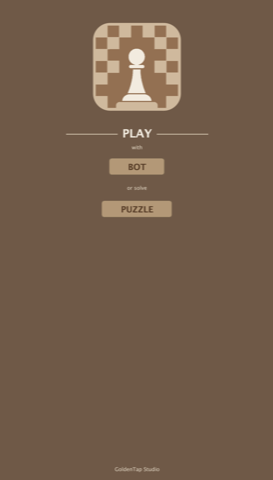
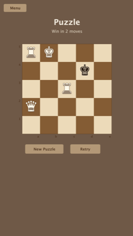
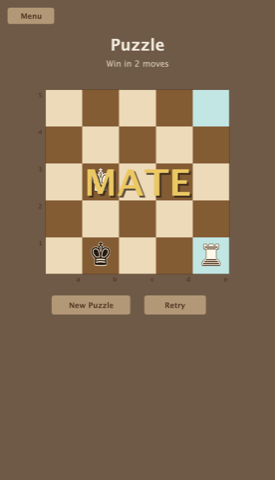
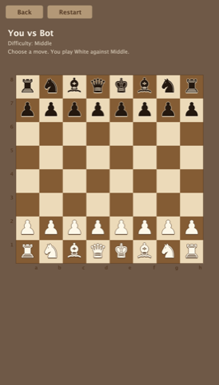

# Checkmater

Checkmater is a free JetBrains plugin focused on fast chess practice inside the IDE.

The plugin currently includes two local play modes:

- `Puzzle`: solve short mate puzzles directly in the tool window
- `Play with Bot`: play a local chess game against the built-in bot

## Features

- native in-IDE experience for JetBrains products
- local-only gameplay
- puzzle mode with quick restart and next-puzzle flow
- local bot mode with selectable difficulty
- clean chess-themed interface

## Screenshots

### Home

### Puzzle Mode

### Bot Mode

### Puzzle Result

## Positioning

Checkmater is designed for short chess sessions without leaving the IDE:

- warm up with a puzzle
- play a quick game against the bot
- return to coding without opening a separate chess app
